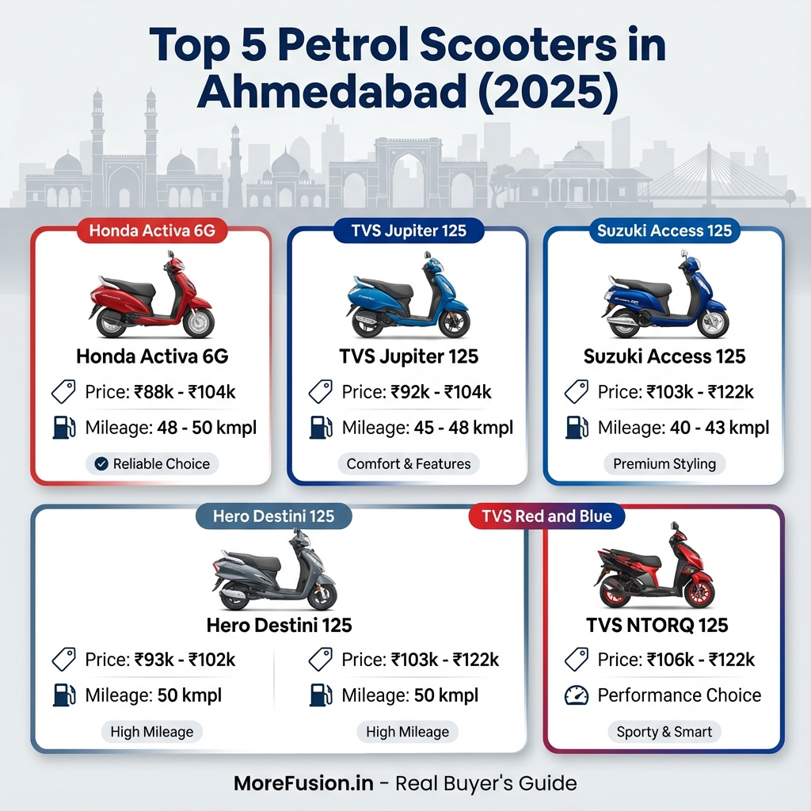

# Best Scooters in Ahmedabad 2025: A Real Buyer's Guide

I've been riding scooters in Ahmedabad for years now, and I know the struggle. You walk into a dealership and everyone's throwing numbers at you—prices, mileage claims, features—and you're supposed to make a decision right there. I wanted to do something different. I've spent the last few weeks comparing every major scooter available in Ahmedabad, checking official prices, real-world mileage reports, and actual performance data for 2025.

This guide is what I wish I had when I bought my first scooter. I'm not here to sell you anything; I'm just sharing what I've learned so you can make a smart choice.

> **Note on Prices**: The prices listed below are **On-Road Prices in Ahmedabad**. This includes RTO registration, insurance, and other mandatory costs, which is why they look higher than the "Ex-Showroom" prices you see in ads. These are the real numbers you'll actually pay.

## The Top Internal Combustion (Petrol) Scooters

> **Going Green?** If you're considering an EV, read our dedicated guide on the [Best Electric Scooters in Ahmedabad](./electric-scooters-india-ahmedabad).

Let me start with the petrol scooters I genuinely think are the best options in Ahmedabad right now. I'm breaking this down by category because different people need different things.

### 1. Honda Activa 6G: The Reliable King

**On-Road Price in Ahmedabad: ₹88,306 - ₹1,04,529**

I have to be honest—the Honda Activa is everywhere in Ahmedabad for a reason. It's not flashy, it's not exciting, but it absolutely works. Every day, I see at least fifty of them on the road.

**Why I'd Choose This:**
The Activa is reliable in a way that almost no other scooter matches. Honda's after-sales service is genuinely good, and parts are dirt cheap if you ever need to fix something.

**The Numbers:**
- **Engine**: 109.51 cc
- **Mileage**: ~48-50 kmpl (Real world)
- **Top Speed**: 90 kmph

**Useful Links:**
- [Official Website](https://www.honda2wheelersindia.com/scooter/activa110)
- [Check Price on BikeWale](https://www.bikewale.com/honda-bikes/activa-6g/price-in-ahmedabad/)

---

### 2. TVS Jupiter 125: The Practical Upgrade

**On-Road Price in Ahmedabad: ₹92,632 - ₹1,04,402**

I really like the Jupiter. It sits in this sweet spot where it's better than the Activa in some ways, offering a 125cc engine for a very competitive price.

**What Makes It Special:**
The Jupiter has a larger 124.8 cc engine, and you genuinely feel that difference. It accelerates a bit quicker and feels more planted. Plus, the under-seat storage is massive because the fuel tank is under the floorboard.

**The Numbers:**
- **Engine**: 124.8 cc
- **Mileage**: ~45-48 kmpl
- **Top Speed**: 95 kmph

**Useful Links:**
- [Official Website](https://www.tvsmotor.com/tvs-jupiter-125)
- [Check Price on BikeWale](https://www.bikewale.com/tvs-bikes/jupiter-125/price-in-ahmedabad/)

---

### 3. Suzuki Access 125: The Comfort Cruiser

**On-Road Price in Ahmedabad: ₹1,03,419 - ₹1,22,000**

I'll be upfront—the prices have gone up, but the Access 125 remains the most comfortable scooter I've sat on. The seat is wide, and the riding position is perfect for taller riders.

**Why It's Worth Considering:**
If your daily commute involves the SG Highway or longer stretches, your back will thank you for choosing the Access. It's smooth, refined, and powerful.

**The Numbers:**
- **Engine**: 124.3 cc
- **Mileage**: ~40-43 kmpl
- **Top Speed**: 90 kmph

**Useful Links:**
- [Official Website](https://www.suzukimotorcycle.co.in/product-details/all-new-access-125-bluetooth-enabled)
- [Check Price on BikeWale](https://www.bikewale.com/suzuki-bikes/access-125/price-in-ahmedabad/)

---

### 4. TVS NTORQ 125: The Sporty Choice

**On-Road Price in Ahmedabad: ₹1,05,827 - ₹1,22,198**

If you want something that looks aggressive and has serious punch, the NTORQ is it. It's the scooter for people who enjoy riding.

**What You're Paying For:**
- Aggressive, sporty design
- Bluetooth connectivity with navigation
- Great acceleration (0-60 in ~9 seconds)

**Useful Links:**
- [Official Website](https://www.tvsmotor.com/commuter/tvs-ntorq/ntorq-125)
- [Check Price on BikeWale](https://www.bikewale.com/tvs-bikes/ntorq-125/price-in-ahmedabad/)

---

### 5. Hero Destini 125: The Budget Premium

**On-Road Price in Ahmedabad: ₹93,006 - ₹1,01,837**

Updated to a 125cc engine, the new Destini is a fantastic value proposition. It offers premium styling (lots of chrome) and decent power at a price point lower than the Access or Activa 125.

**Useful Links:**
- [Official Website](https://www.heromotocorp.com/en-in/scooters/new-destini-125.html)
- [Check Price on BikeWale](https://www.bikewale.com/hero-bikes/destini-125/price-in-ahmedabad/)

---

## Quick Price Comparison Table (2025)

Here's the realistic snapshot of what you'll pay in Ahmedabad today:

| Scooter | Category | On-Road Price Range (Ahmedabad) |
|---------|----------|---------------------------------|
| **Honda Activa 6G** | 110cc Petrol | ₹88,306 - ₹1,04,529 |
| **Hero Destini 125** | 125cc Petrol | ₹93,006 - ₹1,01,837 |
| **TVS Jupiter 125** | 125cc Petrol | ₹92,632 - ₹1,04,402 |
| **Suzuki Access 125**| 125cc Petrol | ₹1,03,419 - ₹1,22,000 |
| **TVS NTORQ 125** | Sporty Petrol | ₹1,05,827 - ₹1,22,198 |

---

## Final Recommendation: What Should You Buy?

**For the Best Value (Petrol):**
Go for the **TVS Jupiter 125**. It gives you 125cc power for roughly the price of a Honda Activa top model. It's practical, spacious, and modern.

**For Peace of Mind:**
You can't beat the **Honda Activa 6G**. It will run forever, and selling it 5 years later will be a breeze.

**For Comfort on Long Rides:**
The **Suzuki Access 125** is unmatched. If you ride 20+ km daily, your back will thank you.

Whatever you choose, make sure to test ride it first. Ahmedabad traffic is its own beast, and you want a scooter you feel comfortable handling in it.

Happy Riding! 🛵

---

## Frequently Asked Questions (FAQs)

### 1. Which scooter gives the best mileage in Ahmedabad traffic?
In real-world Ahmedabad city conditions, the **Honda Activa 6G** and **Hero Destini 125** consistently deliver the best mileage, ranging between **48-52 kmpl**. Efficient riding (avoiding sudden acceleration) can push this higher.

### 2. What is the on-road price of Honda Activa 6G in Ahmedabad in 2025?
The on-road price for the Honda Activa 6G in Ahmedabad ranges from **₹88,306 to ₹1,04,529**, depending on the variant (Standard vs Smart/H-Smart) and optional accessories.

### 3. Which is better for daily office commute: Suzuki Access 125 or TVS Jupiter 125?
If comfort is your priority for long commutes (e.g., SG Highway), the **Suzuki Access 125** is superior due to its refined suspension and seating position. If you need storage space for groceries/helmet and practical features, the **TVS Jupiter 125** wins with its massive under-seat storage.

### 4. Are service costs higher for 125cc scooters compared to 100cc?
Marginally. A 125cc scooter (like Jupiter 125 or Access) might cost ₹200-₹300 more per service than a 110cc Activa due to slightly more expensive oil/parts, but the difference is negligible annually.

### 5. Where can I test drive these scooters in Ahmedabad?
All major brands (Honda, TVS, Suzuki) have multiple dealerships across areas like Satellite, Naroda, Maninagar, and SG Highway. Always test ride on the actual roads you commute on to feel the suspension comfort.